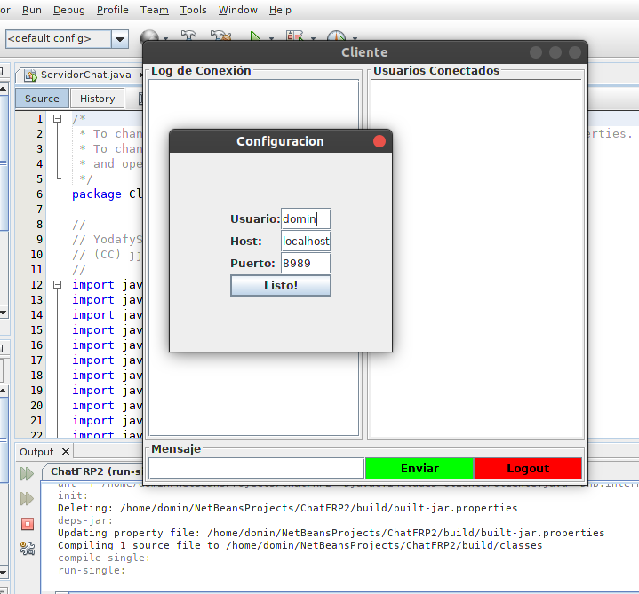

# Chat_MultiUsuario

Proyecto de la asignatura de *Fundamentos de Redes* en el que he desarrollado desde cero una aplicación de escritorio Cliente - Servidor, la cual consiste en un Chat Grupal y Privado. 

Está basada en el uso de Sockets TCP en Java (openJDK 8).

Entre las funcionalidades destacan las típicas de un Chat:

* Envío y recepción de Mensajes a todos y de todos los componentes del Chat (Chat grupal)
* Envío y recepción de Mensajes privados a cualquier usuario conectado en el Chat (Chat privado)
* Posibilidad de exportar la aplicación para cualquier Servidor, independientemente de dónde esté alojado.

## Proceso de ejecución

1. Importar el proyecto a NetBeans (8.2) ó cualquier IDE compatible, aunque se puede extraer el código de la carpeta *src* del proyecto y compilarlo a mano.
2. Ejecutar el archivo ServidorChat.java (Shift+F6). Pondrá en escucha al Servidor, el cual gestionará de forma concurrente todos los usuarios que soliciten acceder al chat (Uso de la Clase Thread).
3. Ejecutar el archivo Cliente.java (Shift +F6) para cada uno de los usuarios deseados. 

## Uso y Testeo

1. Tras iniciar el Servidor y el primer Cliente, se nos solicitará el *Nombre de usuario* a utilizar en el Chat, el *Host* ó dirección IP del Servidor, y el *Puerto* del mismo. Si los dejamos por defecto usará *localhost (127.0.0.1)* y el puerto *8989* (Si dicho puerto estuviera ocupado daría un fallo y se tendría que modificar el mismo en la aplicación del lado del Servidor)

2. Una vez conectado, verás a tu derecha los usuarios con una conexión activa en el servidor. Si escribimos en el chat, todos ellos verán la conversación grupal. Si hacemos *doble click* en alguno de ellos, se abrirá una nueva ventana de chat privado en la que podremos chatear con la persona que queramos. Podemos acumular tantos chats privados como queramos. 

3. Si un usuario cierra la ventana de chat privado con otro usuario, a éste último se le cerrará remotamente su ventana, avisándole en la misma del cierre. 

## Mejoras y versiones venideras

Dado que la finalidad del proyecto era familiarizarnos con el uso de Sockets en Java, puede que queden funcionalidades sin definir y algún que otro cabo suelto, aunque en todas las pruebas realizadas la aplicación cumplía con las espectativas.

Entre las mejoras y pruebas pendientes quedan:
* Optimización del código 
* Adición de Cifrado del texto con Clave Pública-Privada ó bien un cifrado simétrico para empezar. 
* Prueba de instalación en Servidor público con Raspberry pi
* Desarrollo de la aplicación Cliente para Android/IOS
* Testeo de todo lo anterior

